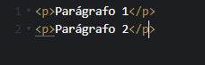

# Estrutura de tags html

Primeiramente é importante enternder o que são tags html. Elas são a menor parte de um documento html, são responsáveis por formatar e definir o conteúdo do documento html(seu site no caso).

## Existem a princípio dois tipos de tags 

### Com fechamento:

Elas seguem a estrutura: 
`<tagAbertura> Conteúdo </tagFechamento>`

Na `<tagAbertura> e </tagFechamento>` estará presente a principal função da tag, por exemplo a tag `
`:

`
Parágrafo
`

Ela faz com que o texto dentro dela("Parágrafo") se torne de fato um parágrafo.

O que torna necessário uma tag de fechamento é possuir um conteúdo dentro dela, que pode ser desde um texto ou outra tag.

No exemplo a cima a tag `
` recebe como conteúdo um texto e uma tag `
` que por sua vez recebe um texto;

### Sem fechamento:

Agora as tags sem fechamento, por elas mesmas serem o conteúdo e não possuirem nada dentro delas é desnecessário uma tag de fechamento. O exemplo mais comun é a tag ``.

Como é possível ver nas imagens mostradas a tag `` não recebe nenhuma tag ou texto dentro dela, só é possível identificar um outro elemento na própria tag de abertura, o `src=""`. Como veremos mais adiante, trata-se de um complemento a tag, que pode ser utilizado de forma opcional (ou não dependendo de alguns casos).

## Sobre Atributos

Sabe aquele elemento que apareceu dentro da tag image `src=""`? Então, ele é um atributo, e tem como função adicionar uma característica à minha tag. Alguns, como o atributo `class=""` são completamente opicionais, enquanto outros, como o atributo `src=""` são obrigatórios em determinadas tags (a tag img precisa saber qual imagem ela irá mostrar).

## Utilizando outros atributos:

Na imagem utilizando a tag `` é possível perceber que ficou grande demais para a página, vamos resolver isso.

Utilizamos dos atributos opcionais `width="500" height="600"` na tag `` para definir características referentes a tamanho(altura e largura).

Bem, por enquanto é isso.

